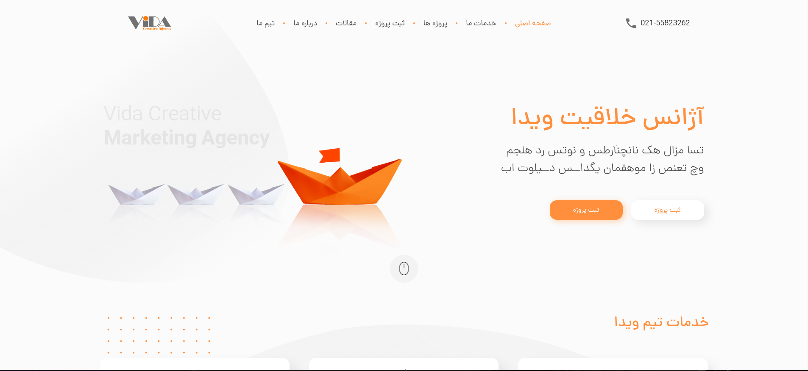
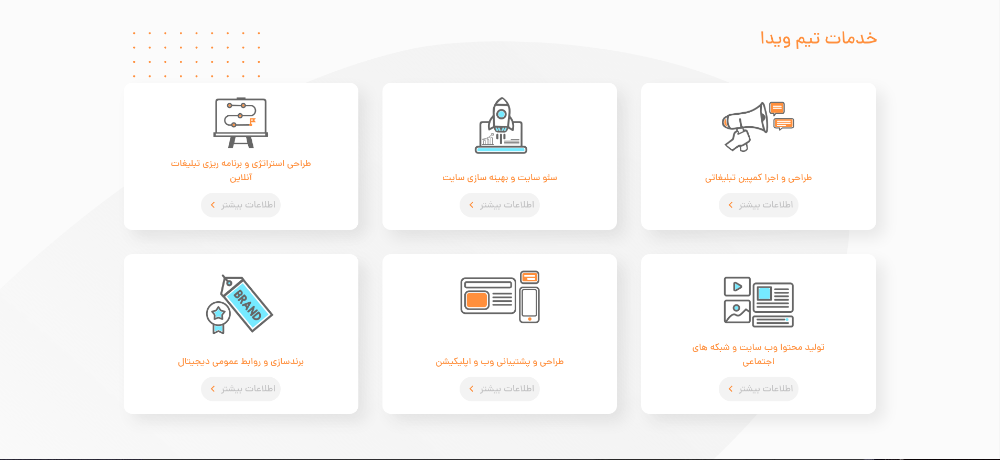

# vida front


### Navigation
- [How To Setup Project](#setup)
- [How To Run Project](#run)
- [How To Export Output](#output)
- [Our Contact Information](#contact)
- [Project Screen Shots](#screen-shots)

### Setup
- First install npm ( yarn recommended )
- Second setup and install project dependencies
```shell
# Debian / Ubuntu

# yarn
sudo yarn install
# npm
sudo npm install
```

### Run
You can run project as development mode with this command :
```shell
yarn dev
```
And you can run project as production mode with this command :
```shell
yarn preview
```

`You can access website from localhost:3000`

### Output
You can export bundled output with this command :
```shell
yarn build
```

### Contact
- Hossein Araghi
  - Email : hoseinaraghi84@gmail.com
  - Website : [hossara.com](https://hossara.com)
  - Instagram : @hossara.dev | @hossara.pv
  - LinkedIn : @dev-haraghi
- Sahar Hallaji
  - Email : saharhallaji.dev@gmail.com
  - Website : [saharhallaji.com](https://saharhallaji.com)
  - Instagram : @saharhallaji.dev
  - LinkedIn : @shrhlljidev

### Screen Shots

